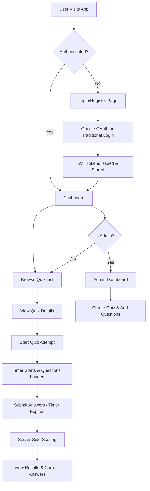

# T1-Farhad-QuizPortal

A full-stack **Quiz Portal** application built with Django REST Framework and React + TypeScript.

## 🏗️ Architecture & Application Flow

### Application Flow Chart


### High-Level Architecture
```
┌─────────────────┐    REST API     ┌──────────────────┐
│   React + TS    │ ◄──────────────► │  Django + DRF    │
│   (Vite)        │    JWT Auth     │  (Python)        │
│   TailwindCSS   │                 │  SQLite/Postgres │
└─────────────────┘                 └──────────────────┘
```

## 🛠️ Tech Stack

| Layer          | Technology                          |
|:---------------|:------------------------------------|
| Frontend       | React 19, TypeScript, Vite 7        |
| Styling        | TailwindCSS v4                      |
| Backend        | Django 4.2, Django REST Framework   |
| Database       | SQLite (dev) / PostgreSQL (prod)    |
| Authentication | Google OAuth 2.0  + JWT (SimpleJWT) |
| HTTP Client    | Axios                               |

## 📁 Folder Structure

```
T1-Farhad-QuizPortal/
├── backend/
│   ├── manage.py
│   ├── requirements.txt
│   ├── .env.example
│   ├── config/
│   │   ├── settings.py
│   │   ├── urls.py
│   │   ├── wsgi.py
│   │   └── asgi.py
│   └── apps/
│       ├── users/          # Custom User model
│       ├── authentication/ # Google OAuth + JWT
│       ├── quizzes/        # Quiz & Question CRUD
│       └── attempts/       # Attempt submission & scoring
├── frontend/
│   ├── index.html
│   ├── package.json
│   ├── vite.config.ts
│   ├── tsconfig.json
│   ├── .env.example
│   └── src/
│       ├── main.tsx
│       ├── App.tsx
│       ├── index.css
│       ├── types/
│       ├── services/
│       ├── context/
│       ├── components/
│       └── pages/
├── README.md
└── .gitignore
```

## 📡 API Documentation

### Authentication

| Method | Endpoint                  | Auth | Description                |
|:-------|:--------------------------|:-----|:---------------------------|
| POST   | `/api/auth/google-login/` | No   | Login with Google OAuth    |
| GET    | `/api/auth/me/`           | JWT  | Get current user profile   |

### Quizzes

| Method | Endpoint                                  | Auth  | Description            |
|:-------|:------------------------------------------|:------|:-----------------------|
| GET    | `/api/quizzes/`                           | JWT   | List all quizzes       |
| GET    | `/api/quizzes/<id>/`                      | JWT   | Get quiz with questions|
| POST   | `/api/quizzes/create/`                    | Admin | Create a new quiz      |
| GET    | `/api/quizzes/<id>/questions/`            | JWT   | List quiz questions    |
| POST   | `/api/quizzes/<id>/questions/create/`     | Admin | Add question to quiz   |

### Attempts

| Method | Endpoint                    | Auth | Description             |
|:-------|:----------------------------|:-----|:------------------------|
| POST   | `/api/attempt/`             | JWT  | Submit quiz attempt     |
| GET    | `/api/attempts/<id>/`       | JWT  | Get attempt detail      |
| GET    | `/api/my-attempts/`         | JWT  | Current user's attempts |
| GET    | `/api/results/<user_id>/`   | JWT  | User's results          |

## ⚙️ Environment Variables

### Backend (`backend/.env`)

```env
SECRET_KEY=your-secret-key
DEBUG=True
ALLOWED_HOSTS=localhost,127.0.0.1
USE_SQLITE=True
DB_NAME=quiz_portal
DB_USER=postgres
DB_PASSWORD=your-password
DB_HOST=localhost
DB_PORT=5432
GOOGLE_CLIENT_ID=your-google-client-id.apps.googleusercontent.com
FRONTEND_URL=http://localhost:5173
ADMIN_EMAILS=admin@example.com
```

### Frontend (`frontend/.env`)

```env
VITE_GOOGLE_CLIENT_ID=your-google-client-id.apps.googleusercontent.com
VITE_API_URL=http://localhost:8000/api
```

## 🚀 Installation & Running Locally

> **Important:** Please see [`SETUP.md`](SETUP.md) for explicit Database Schema setups, custom PostgreSQL configuration, and Data Seeding instructions.
>
> Please see [`DEPLOYMENT.md`](DEPLOYMENT.md) for full hosting instructions.
>
> UI Screenshots can be found in the [`screens/`](screens/) directory.

### Prerequisites

- Python 3.10+
- Node.js 18+
- Google Cloud Console project with OAuth 2.0 credentials

### Backend Setup

```bash
cd backend

# Create virtual environment
python -m venv venv
source venv/bin/activate   # Linux/Mac
venv\Scripts\activate      # Windows

# Install dependencies
pip install -r requirements.txt

# Copy and configure .env
cp .env.example .env
# Edit .env with your values

# Run migrations
python manage.py makemigrations
python manage.py migrate

# Create superuser (optional)
python manage.py createsuperuser

# Start server
python manage.py runserver
```

### Frontend Setup

```bash
cd frontend

# Install dependencies
npm install

# Copy and configure .env
cp .env.example .env
# Edit .env with your Google Client ID

# Start dev server
npm run dev
```

### Google OAuth Setup

1. Go to [Google Cloud Console](https://console.cloud.google.com/)
2. Create a new project or select existing
3. Enable **Google+ API** / **Google Identity**
4. Go to **Credentials** → **Create Credentials** → **OAuth 2.0 Client ID**
5. Application type: **Web application**
6. Authorized JavaScript origins: `http://localhost:5173`
7. Authorized redirect URIs: `http://localhost:5173`
8. Copy the **Client ID** and set it in both `backend/.env` and `frontend/.env`

## 🔐 Security

- Google token verified server-side via `google-auth` library
- JWT-based API authentication (6h access, 7d refresh)
- Protected API routes with `IsAuthenticated` permission
- Admin role via hardcoded email list (not frontend-controlled)
- Correct answers hidden from API during quiz attempt
- **Server-side scoring** — client answers are never trusted

## 🚢 Deployment Guide

### Backend (e.g., Railway, Render, Heroku)

1. Set `DEBUG=False` and configure `ALLOWED_HOSTS`
2. Set `USE_SQLITE=False` and configure PostgreSQL credentials
3. Add `SECRET_KEY` as a secure random string
4. Run `python manage.py migrate` on deploy
5. Collect static files: `python manage.py collectstatic`

### Frontend (e.g., Vercel, Netlify)

1. Set `VITE_GOOGLE_CLIENT_ID` and `VITE_API_URL`
2. Build command: `npm run build`
3. Publish directory: `dist`

## 📋 Features

- ✅ Google OAuth 2.0 login
- ✅ JWT authentication with auto-refresh
- ✅ Quiz listing with pagination
- ✅ Timed quiz attempts with countdown
- ✅ Auto-submit on timer expiry
- ✅ Server-side scoring
- ✅ Detailed result review
- ✅ Attempt history
- ✅ Admin quiz & question creation
- ✅ Toast notifications
- ✅ Loading skeletons
- ✅ Protected routes (user & admin)
- ✅ Responsive dark theme with glassmorphism

## 📝 Assumptions & Trade-offs
- **Server-Side Scoring Strategy**: To prevent cheating, the client is never sent the correct answers until the quiz is submitted. The backend calculates the final score.
- **SQLite over Postgres for Dev**: SQLite is set as the default database to ensure zero-friction setup for reviewers. A `docker-compose.yml` and `Dockerfile` are provided for true PostgreSQL production replication if needed.
- **Admin Role-Based Access Control**: Admin access is governed by the `ADMIN_EMAILS` environment variable rather than a frontend toggle, keeping authorization strictly server-enforced and immune to client-side manipulation.
- **Google OAuth**: A dummy test button (`Admin Login`) is kept explicitly for easy reviewer testing in the `DEV` environment without needing an actual Google account.
